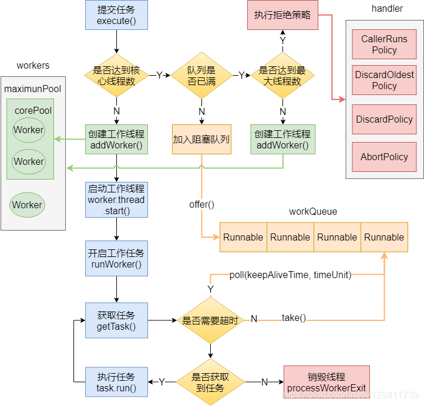
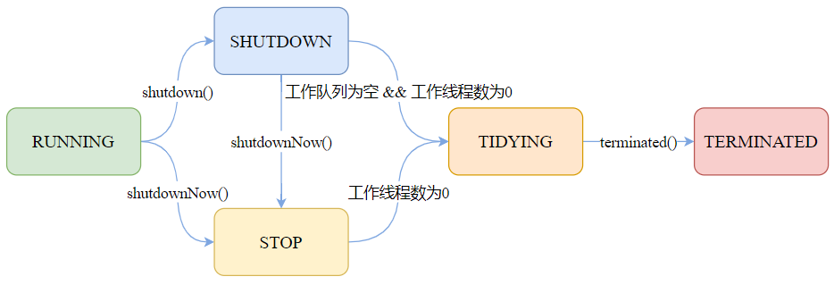
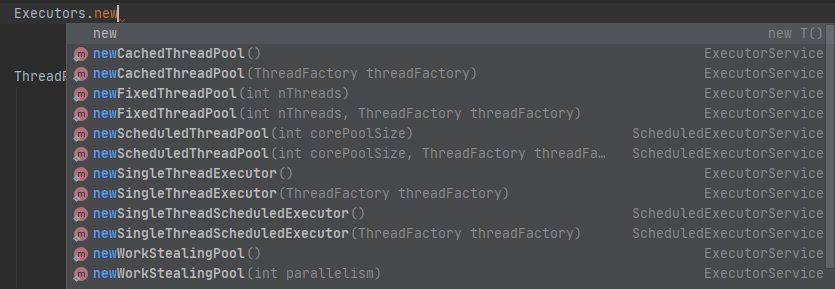

### ThreadPool 线程池


### ThreadPool 基础知识


### ThreadPool 源码分析


### ThreadPool 常见问题

#### （1）为什么要使用线程池？直接new个线程不行吗？

如果我们在方法中直接new一个线程来处理，当这个方法被调用频繁时就会创建很多线程，不仅会消耗系统资源，还会降低系统的稳定性，一不小心**把系统搞崩了**，就可以**直接去财务那结帐**了。

如果我们合理的使用线程池，则可以避免把系统搞崩的窘境。总得来说，使用线程池可以带来以下几个好处：

1. 降低资源消耗。通过重复利用已创建的线程，降低线程创建和销毁造成的消耗。
2. 提高响应速度。当任务到达时，任务可以不需要等到线程创建就能立即执行。
3. 增加线程的可管理型。线程是稀缺资源，使用线程池可以进行统一分配，调优和监控。

#### （2）线程的核心属性有哪些？

- threadFactory（线程工厂）：用于创建工作线程的工厂
- corePoolSize（核心线程数）：当线程池运行的线程少于 corePoolSize 时，将创建一个新线程来处理请求，即使其他工作线程处于空闲状态
- workQueue（队列）：用于保留任务并移交给工作线程的阻塞队列
- maximumPoolSize（最大线程数）：线程池允许开启的最大线程数
- handler（拒绝策略）：往线程池添加任务时，将在下面两种情况触发拒绝策略：1）线程池运行状态不是 RUNNING；2）线程池已经达到最大线程数，并且阻塞队列已满时
- keepAliveTime（保持存活时间）：如果线程池当前线程数超过 corePoolSize，则多余的线程空闲时间超过 keepAliveTime 时会被终止

#### （3）线程池的运作流程

 

#### （4）线程池各个状态含义？

线程池目前有5个状态，在线程中使用二进制**高3位表示线程池中线程的运行状态** 

- RUNNING：接受新任务并处理排队的任务。
- SHUTDOWN：不接受新任务，但处理排队的任务。
- STOP：不接受新任务，不处理排队的任务，并中断正在进行的任务。
- TIDYING：所有任务都已终止，workerCount 为零，线程转换到 TIDYING 状态将运行 terminated() 钩子方法。
- TERMINATED：terminated() 已完成。

**代码实例** 

```java
    // 各个线程的运行状态 
    // RUNNING -> SHUTDOWN
    //    On invocation of shutdown(), perhaps implicitly in finalize()
    //    调用shutdown（）时，可能隐式地在finalize中
    // (RUNNING or SHUTDOWN) -> STOP
    //    On invocation of shutdownNow()
    // SHUTDOWN -> TIDYING
    //    When both queue and pool are empty
    // STOP -> TIDYING
    //    When pool is empty
    // TIDYING -> TERMINATED
    //    When the terminated() hook method has completed
    // Threads waiting in awaitTermination() will return when the
    // state reaches TERMINATED.
    private final AtomicInteger ctl = new AtomicInteger(ctlOf(RUNNING, 0));
    private static final int COUNT_BITS = Integer.SIZE - 3;
    private static final int CAPACITY   = (1 << COUNT_BITS) - 1;

    // runState is stored in the high-order bits
    private static final int RUNNING    = -1 << COUNT_BITS;
    private static final int SHUTDOWN   =  0 << COUNT_BITS;
    private static final int STOP       =  1 << COUNT_BITS;
    private static final int TIDYING    =  2 << COUNT_BITS;
    private static final int TERMINATED =  3 << COUNT_BITS;
```

#### （5）这几个状态之间怎么流转的？

 

#### （6）线程池有哪些队列？

 

- ArrayBlockingQueue：基于数组结构的有界阻塞队列，按先进先出对元素进行排序。
- LinkedBlockingQueue：基于链表结构的有界/无界阻塞队列，按先进先出对元素进行排序，吞吐量通常高于 ArrayBlockingQueue。Executors.newFixedThreadPool 使用了该队列
- SynchronousQueue：不是一个真正的队列，而是一种在线程之间移交的机制。要将一个元素放入 SynchronousQueue 中，必须有另一个线程正在等待接受这个元素。如果没有线程等待，并且线程池的当前大小小于最大值，那么线程池将创建一个线程，否则根据拒绝策略，这个任务将被拒绝。使用直接移交将更高效，因为任务会直接移交给执行它的线程，而不是被放在队列中，然后由工作线程从队列中提取任务。只有当线程池是无界的或者可以拒绝任务时，该队列才有实际价值。Executors.newCachedThreadPool使用了该队列
- PriorityBlockingQueue：具有优先级的无界队列，按优先级对元素进行排序。元素的优先级是通过自然顺序或 Comparator 来定义的。
- DelayQueue：是一个无界的BlockingQueue，用于放置实现了Delayed接口的对象，其中的对象只能在其到期时才能从队列中取走。这种队列是有序的，即队头对象的延迟到期时间最长。注意：不能将null元素放置到这种队列中，[基于DelayQueue的 延迟队列](https://www.cnblogs.com/myseries/p/10944211.html) 

#### （7）使用队列有什么需要注意的吗？

1. 使用有界队列时，需要注意线程池满了后，被拒绝的任务如何处理。

2. 使用无界队列时，需要注意如果任务的提交速度大于线程池的处理速度，可能会导致内存溢出。

#### （8）线程池有哪些拒绝策略？

- AbortPolicy：中止策略。默认的拒绝策略，直接抛出 RejectedExecutionException。调用者可以捕获这个异常，然后根据需求编写自己的处理代码。

- DiscardPolicy：抛弃策略。什么都不做，直接抛弃被拒绝的任务。

- DiscardOldestPolicy：抛弃最老策略。抛弃阻塞队列中最老的任务，相当于就是队列中下一个将要被执行的任务，然后重新提交被拒绝的任务。如果阻塞队列是一个优先队列，那么“抛弃最旧的”策略将导致抛弃优先级最高的任务，因此最好不要将该策略和优先级队列放在一起使用。

- CallerRunsPolicy：调用者运行策略。在调用者线程中执行该任务。该策略实现了一种调节机制，该策略既不会抛弃任务，也不会抛出异常，而是将任务回退到调用者（调用线程池执行任务的主线程），由于执行任务需要一定时间，因此主线程至少在一段时间内不能提交任务，从而使得线程池有时间来处理完正在执行的任务。

#### （9）线程只能在任务到达时才启动吗？

默认情况下，即使是核心线程也只能在新任务到达时才创建和启动。但是我们可以使用 

- prestartCoreThread（启动一个核心线程）
-  prestartAllCoreThreads（启动全部核心线程）方法来提前启动核心线程。

#### （10）核心线程怎么实现一直存活

阻塞队列方法有四种形式，它们以不同的方式处理操作，如下表

|      | 抛出异常  | 返回特殊值 | 一直阻塞 | 超时退出           |
| ---- | --------- | ---------- | -------- | ------------------ |
| 插入 | add(e)    | offer(e)   | put(e)   | offer(e,time,unit) |
| 移除 | remove()  | poll()     | take()   | poll(time,unit)    |
| 检查 | element() | peek()     | 不可用   | 不可用             |

核心线程在获取任务时，通过阻塞队列的 take() 方法实现的一直阻塞（存活）。

#### （11）非核心线程如何实现在KeepAliveTime 后死亡？

原理同上，也是利用阻塞队列的方法，在获取任务时通过阻塞队列的 poll(time,unit) 方法实现的在延迟死亡。

#### （12）非核心线程能成为核心线程吗？

虽然我们一直讲着核心线程和非核心线程，但是其实线程池内部是不区分核心线程和非核心线程的。只是根据当前线程池的工作线程数来进行调整，因此看起来像是有核心线程和非核心线程。

#### （13）如何终止线程池？

终止线程池主要有两种方式：

1. shutdown：“温柔”的关闭线程池。不接受新任务，但是在关闭前会将之前提交的任务处理完毕。

2. shutdownNow：“粗暴”的关闭线程池，也就是直接关闭线程池，通过 Thread#interrupt() 方法终止所有线程，不会等待之前提交的任务执行完毕。但是会返回队列中未处理的任务。

#### （14）Executors 提供了哪些创建线程池的方法

 

- newFixedThreadPool：固定线程数的线程池。corePoolSize = maximumPoolSize，keepAliveTime为0，工作队列使用无界的LinkedBlockingQueue。适用于为了满足资源管理的需求，而需要限制当前线程数量的场景，适用于负载比较重的服务器。

- newSingleThreadExecutor：只有一个线程的线程池。corePoolSize = maximumPoolSize = 1，keepAliveTime为0， 工作队列使用无界LinkedBlockingQueue。适用于需要保证顺序的执行各个任务的场景。

- newCachedThreadPool： 按需要创建新线程的线程池。核心线程数为0，最大线程数为 Integer.MAX_VALUE，keepAliveTime为60秒，工作队列使用同步移交 SynchronousQueue。该线程池可以无限扩展，当需求增加时，可以添加新的线程，而当需求降低时会自动回收空闲线程。适用于执行很多的短期异步任务，或者是负载较轻的服务器。
- newScheduledThreadPool：创建一个以延迟或定时的方式来执行任务的线程池，工作队列为 DelayedWorkQueue。适用于需要多个后台线程执行周期任务。
- newWorkStealingPool：JDK 1.8 新增，用于创建一个可以窃取的线程池，底层使用 ForkJoinPool 实现。

#### （15）线程池里有个 ctl，你知道它是如何设计的吗

> ctl 是一个打包两个概念字段的原子整数

- workerCount：指示线程的有效数量；
- runState：指示线程池的运行状态，有 RUNNING、SHUTDOWN、STOP、TIDYING、TERMINATED 等状态。

int 类型有32位，其中 ctl 的低29为用于表示 workerCount，高3位用于表示 runState，如下图所示。

 

例如，当我们的线程池运行状态为 RUNNING，工作线程个数为3，则此时 ctl 的原码为：1010 0000 0000 0000 0000 0000 0000 0011

#### （16）ctl 为什么这么设计？有什么好处吗？

个人认为，ctl 这么设计的主要好处是将对 runState 和 workerCount 的操作封装成了一个原子操作。

runState 和 workerCount 是线程池正常运转中的2个最重要属性，线程池在某一时刻该做什么操作，取决于这2个属性的值。

因此无论是查询还是修改，我们必须保证对这2个属性的操作是属于“同一时刻”的，也就是原子操作，否则就会出现错乱的情况。如果我们使用2个变量来分别存储，要保证原子性则需要额外进行加锁操作，这显然会带来额外的开销，而将这2个变量封装成1个 AtomicInteger 则不会带来额外的加锁开销，而且只需使用简单的位操作就能分别得到 runState 和 workerCount。

由于这个设计，workerCount 的上限 CAPACITY   = (1 << 29) - 1，对应的二进制原码为：0001 1111 1111 1111 1111 1111 1111 1111（不用数了，29个1）。

通过 ctl 得到 runState，只需通过位操作：ctl & ~CAPACITY。

~（按位取反），于是“~CAPACITY”的值为：1110 0000 0000 0000 0000 0000 0000 0000，只有高3位为1，与 ctl 进行 & 操作，结果为 ctl 高3位的值，也就是 runState。

通过 ctl 得到 workerCount 则更简单了，只需通过位操作：c & CAPACITY。

综上：

- runState = ctl & ~CAPACITY （按位取反做&运算 高三位表示线程的运行状态）
- workerCount  = ctl & CAPACITY （直接做&运算，得到工作线程数）

#### （17）在我们实际使用中，线程池的大小配置多少合适？

要想合理的配置线程池大小，首先我们需要区分任务是计算密集型还是I/O密集型。

- 对于计算密集型，设置 线程数 = CPU数 + 1，通常能实现最优的利用率。

- 对于I/O密集型，网上常见的说法是设置 线程数 = CPU数 * 2 ，这个做法是可以的，但个人觉得不是最优的。

在我们日常的开发中，我们的任务几乎是离不开I/O的，常见的网络I/O（RPC调用）、磁盘I/O（数据库操作），并且I/O的等待时间通常会占整个任务处理时间的很大一部分，在这种情况下，开启更多的线程可以让 CPU 得到更充分的使用，一个较合理的计算公式如下：

- 线程数 = CPU数 * CPU利用率 * (任务等待时间 / 任务计算时间 + 1)

例如我们有个定时任务，部署在4核的服务器上，该任务有100ms在计算，900ms在I/O等待，则线程数约为：4 * 1 * (1 + 900 / 100) = 40个。

当然，具体我们还要结合实际的使用场景来考虑。

### 相关文章

1. [常见问题梳理——程序员人囧辉](https://blog.csdn.net/v123411739/category_10490155.html)  
2. [详细源码分析之ThreadPoolExecutor](https://wwxw.gitee.io/wxw-document/#/%E5%90%8E%E7%AB%AF%E6%8A%80%E6%9C%AF/Java%E5%9F%BA%E7%A1%80%E7%9F%A5%E8%AF%86/JDK8%E6%BA%90%E7%A0%81/?id=_3-threadpoolexecutor) 
3. [延迟队列分析梳理](https://github.com/GitHubWxw/wxw-concurrent/tree/master/cloud-delayqueue) 